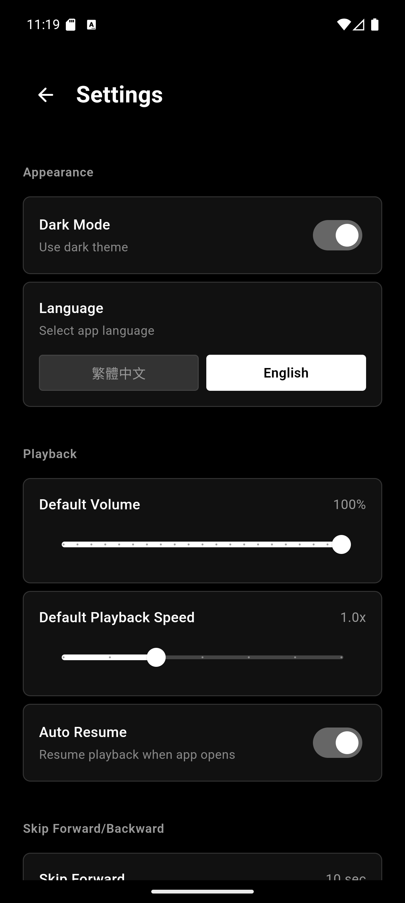
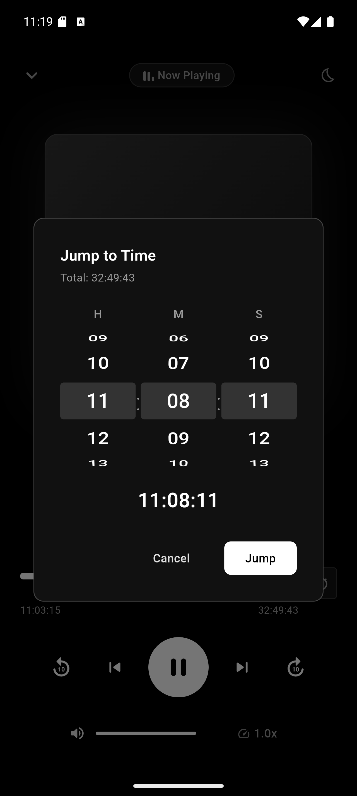
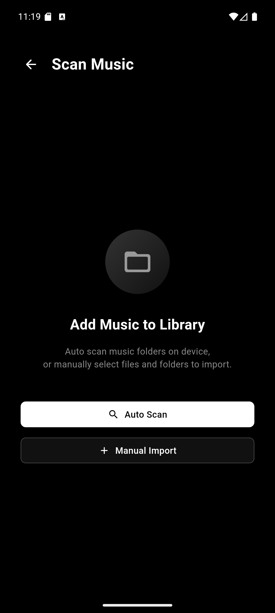
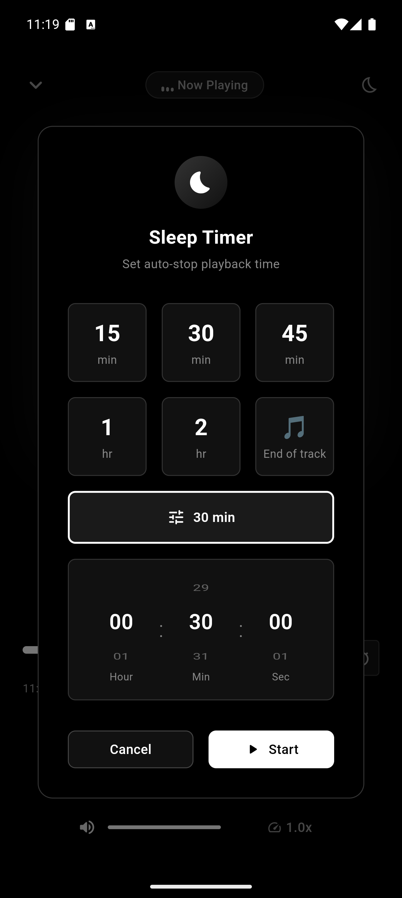
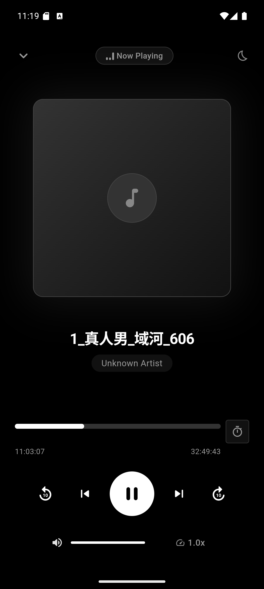
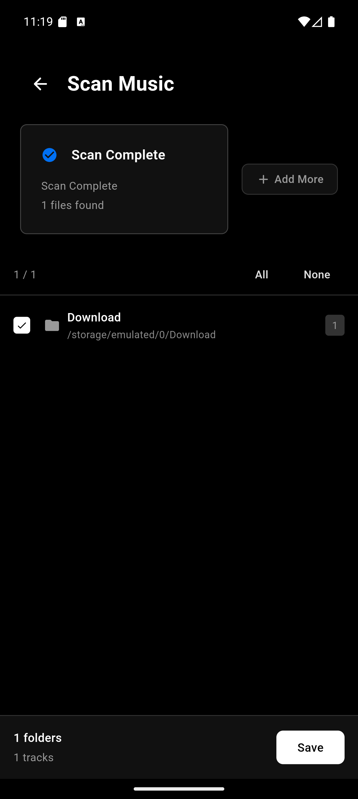

<p align="center">
  
</p>

<h1 align="center">Pulse</h1>

<p align="center">
  A minimalist local music player built with Flutter. Works on Windows, macOS, Linux, and Android.
</p>

## Screenshots

<p align="center">
  &nbsp;&nbsp;
  &nbsp;&nbsp;
  
</p>

<p align="center">
  &nbsp;&nbsp;
  &nbsp;&nbsp;
  
</p>

## Features

- Local audio playback (MP3, FLAC, WAV, AAC, OGG)
- Background playback with system media controls
- Folder scanning and library management
- Sleep timer
- Dark/Light theme (Vercel-inspired design)
- Multi-language (English, 繁體中文)

## Download

Get the latest release from [Releases](https://github.com/911218sky/pulse/releases).

| Platform | File |
|----------|------|
| Windows | `Pulse-windows-x64.zip` |
| macOS | `Pulse-macos.zip` |
| Linux | `Pulse-linux-x64.tar.gz` |
| Android (arm64) | `Pulse-android-arm64-v8a.apk` |
| Android (arm32) | `Pulse-android-armeabi-v7a.apk` |
| Android (x86_64) | `Pulse-android-x86_64.apk` |

## Development

### Requirements

- Flutter 3.24.0+
- Dart 3.7.0+

### Setup

```bash
git clone https://github.com/911218sky/pulse.git
cd pulse
flutter pub get
flutter run
```

### Build

```bash
# Windows
flutter build windows --release

# macOS
flutter build macos --release

# Linux
flutter build linux --release

# Android
flutter build apk --release
```

### Project Structure

```
lib/
├── core/           # Theme, router, constants, DI
├── data/           # Models, database, services
├── domain/         # Entities, repository interfaces
└── presentation/   # Screens, widgets, BLoC
```

## Tech Stack

- **Framework**: Flutter
- **State**: flutter_bloc
- **Database**: Drift (SQLite)
- **Audio**: media_kit + audio_service
- **Router**: go_router
- **DI**: get_it

## License

[GNU](LICENSE)
