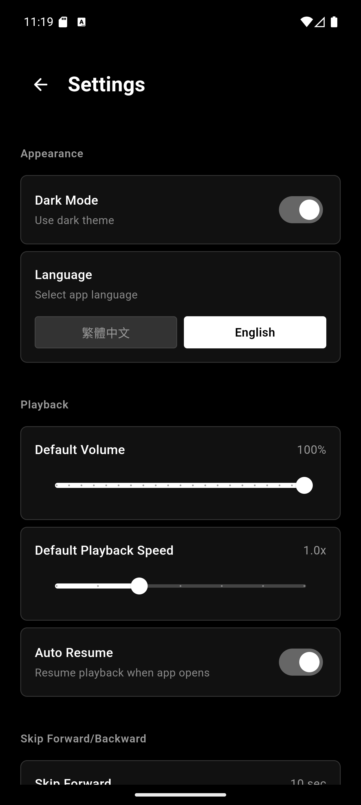
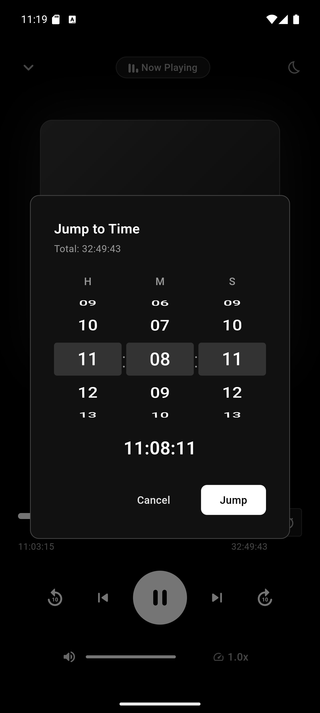
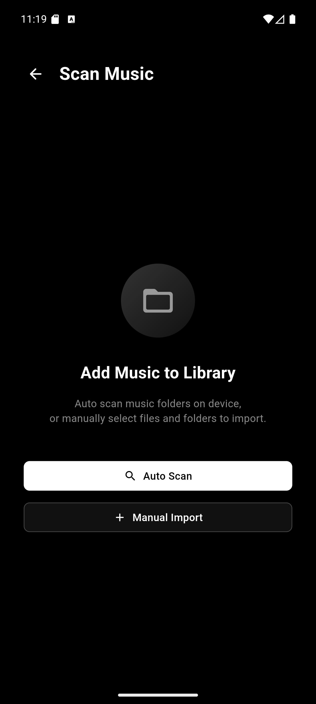
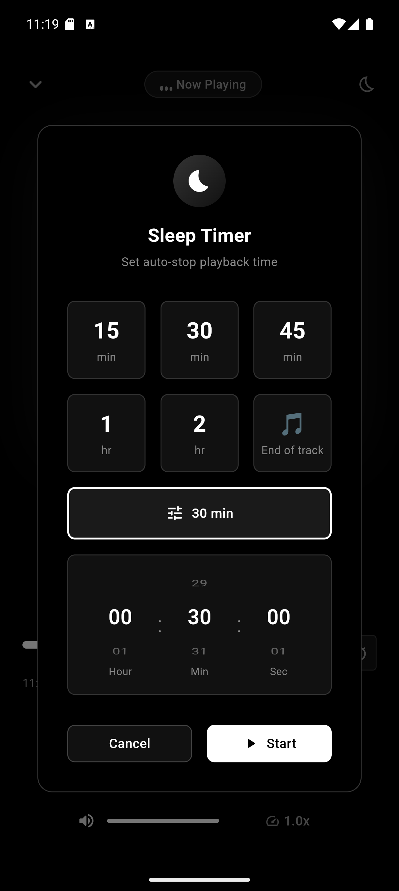
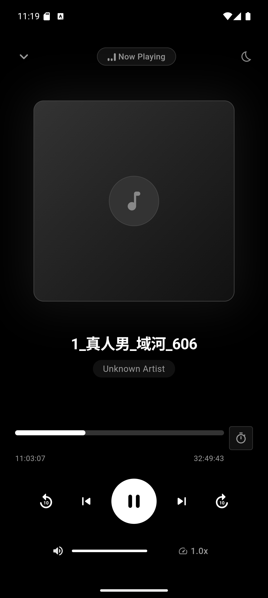
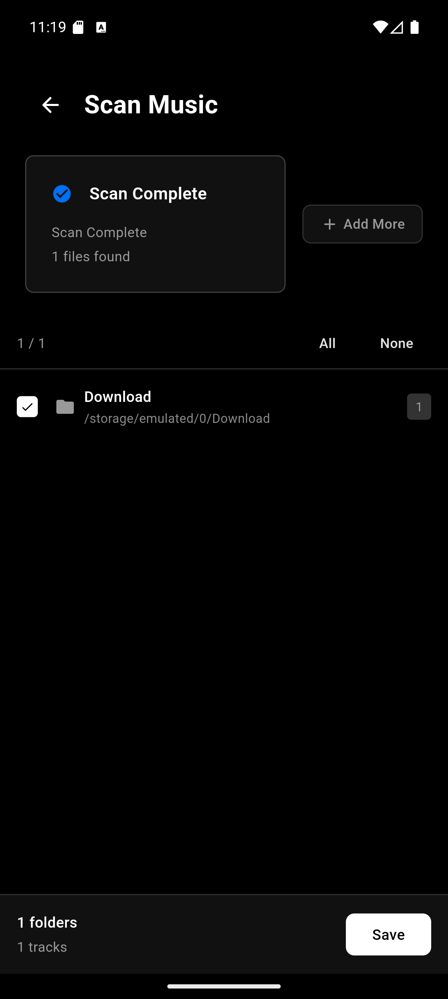

<p align="center">
  
</p>

<h1 align="center">Pulse</h1>

<p align="center">
  A local-first music player built with Flutter for Windows, macOS, Linux, and Android.
</p>

<p align="center">
  Pulse keeps your library, playlists, settings, and playback progress on your device. No account, no cloud sync, no streaming service dependency.
</p>

## Highlights

- Local playback for `MP3`, `FLAC`, `WAV`, `AAC`, `OGG`, and `M4A`
- Background playback with system media controls
- Playback position memory with resume support
- Optional prompt to resume from the last saved position
- Folder scan and manual import for local music files
- Playlist creation, editing, and reordering
- Sleep timer, playback speed, volume, and skip interval controls
- Built-in update checks from GitHub Releases
- Interface languages: English, Traditional Chinese, Simplified Chinese

## Screenshots

<p align="center">
  &nbsp;&nbsp;
  &nbsp;&nbsp;
  
</p>

<p align="center">
  &nbsp;&nbsp;
  &nbsp;&nbsp;
  
</p>

## Downloads

Latest builds are published on [GitHub Releases](https://github.com/911218sky/pulse/releases).

For most Android users, install `pulse-android-universal.apk`.

| Platform | Asset |
| --- | --- |
| Windows | `pulse-windows-x64.zip` |
| macOS | `pulse-macos-universal.zip` |
| Linux | `pulse-linux-x64.tar.gz` |
| Android | `pulse-android-universal.apk` |
| Android arm64 | `pulse-android-arm64-v8a.apk` |
| Android armeabi-v7a | `pulse-android-armeabi-v7a.apk` |
| Android x86_64 | `pulse-android-x86_64.apk` |
| Android bundle | `pulse-android-release.aab` |

## Behavior Notes

- Pulse stores app data locally in SQLite.
- Playback progress is remembered per file.
- When a track has saved progress, Pulse can either resume immediately or show a short resume prompt, depending on the playback path and settings.
- `Clear All Data` inside the app removes settings, library records, playlists, playback history, and saved positions.

## Development

### Requirements

- Flutter stable
- Dart `3.7.2` or newer

### Setup

```bash
git clone https://github.com/911218sky/pulse.git
cd pulse
flutter pub get
flutter run
```

### Verification

```bash
dart format --set-exit-if-changed .
flutter analyze
flutter test
```

### Release Builds

```bash
flutter build windows --release
flutter build macos --release
flutter build linux --release
flutter build apk --release
flutter build appbundle --release
```

## Project Structure

```text
lib/
|-- core/           Shared theme, routing, localization, utilities, DI
|-- data/           Database, repositories, services, persistence models
|-- domain/         Entities and repository interfaces
`-- presentation/   Screens, widgets, and BLoCs
```

## Stack

- Flutter
- `flutter_bloc`
- Drift + SQLite
- `media_kit`
- `audio_service`
- `go_router`
- `get_it`

## License

Pulse is licensed under the [GNU GPL v3](LICENSE).
